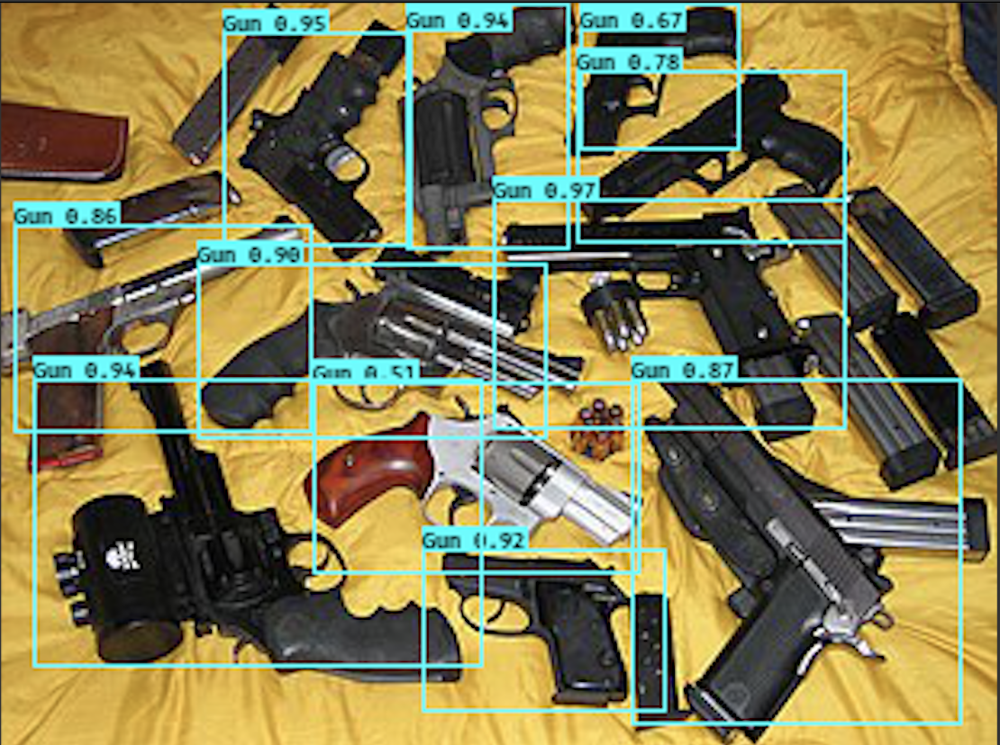
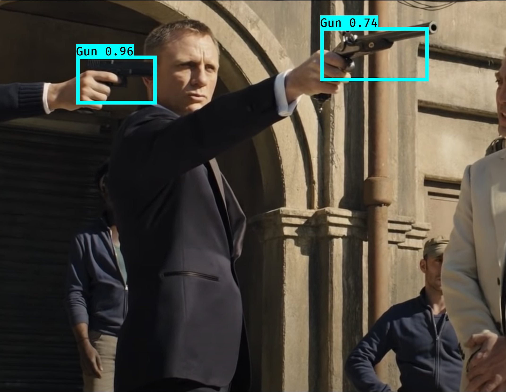
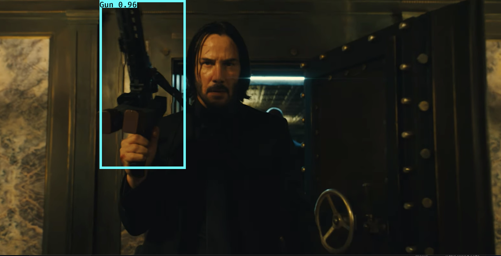
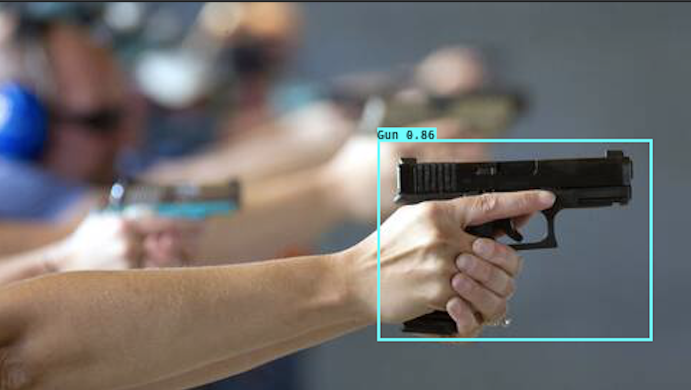

# YOLOV3 : Real-time Firearm Detection

## Summary

This project aim to study the YOLOV3 architecture, and use it with transfert
learning to be able to detect a new type of object : firearm. This project could be
usefull to alert the police when an arm robbery take place and a  firearm can be
detected on a surveillance camera.

## Files on the repository
Due to the weight of the files, the implementation + dataset + custom weight can be found on my gitlab account :
[mprieur gitlab](https://gitlab.insa-rouen.fr/mprieur/firearm-yolov3)

## Examples of images processed by the trained model
    

## User Guide

### Packages
- Python 3.5.2
- Keras 2.1.5
- tensorflow 1.6.0

### Hardware
- Can be use either with a CPU or GPU (it is quicker with GPU)

### Steps
- Create your virtual env / conda env
- In the keras folder : 
 <code> python yolo_video.py [OPTIONS...] --image, for image detection mode, OR
python yolo_video.py [video_path] [output_path (optional)]</code>

 - You might have to modify the code to analyse custom video...

## Possible improvements
- The architecture is only a keras adaptation of the Darknet architecture and using the original with transfer learning might be more efficient.
- A lot of new architecture have been released since YOLOV3 and could provide better results. It would be interesting to train model like CenterNet ResNet-18 or  DSOD300 + VoVNet-27-slim.
- Only a few pictures has been labeled and with not that much diversity on the content. Create a larger dataset would make a more robust model.

## Thanks
We would like to thanks the INSA of Rouen and Clément Chatelain our Machine-Learning 
teacher for giving us the time and opportunity to work on a project on our own.

## GIT used
[Qqwweee git](https://github.com/qqwweee)
